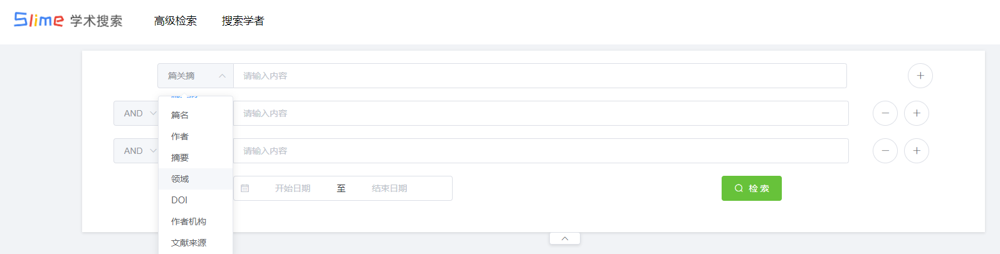
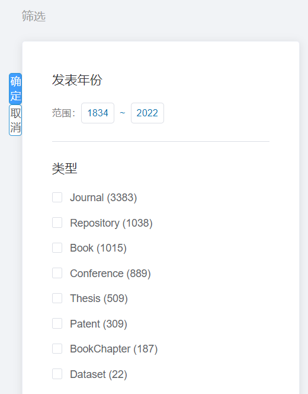
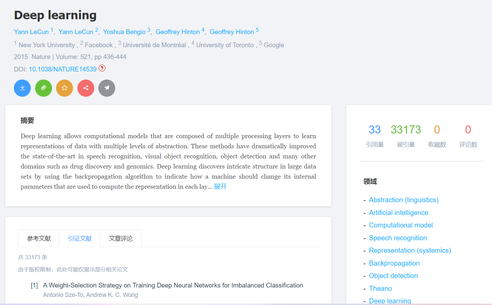
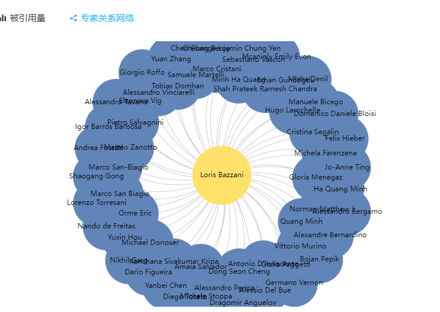
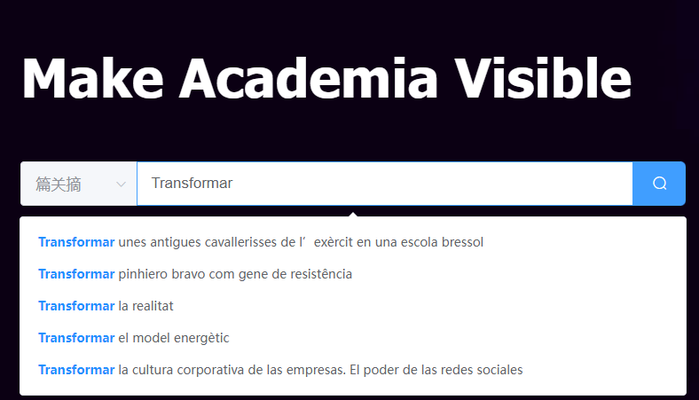

# Slime Scholar backend

### 运行指南

进入`utils/secret.go`中填充基本信息，如：数据库信息，邮件代理信息，redis与elasticsearch的地址

随后初始化包 ： `go mod tidy`,下载与生成依赖 

运行 go run ./main.go 即可运行后端，本项目需结合[前端]() 使用

## 近况

当前网站的[部署地址](https://slime.matrix53.top/) ，服务器将于1月2日到期，

由于本网站的数据量使用了Microsoft Academic Graph的全部数据，需要耗费大量的磁盘空间（500G+)，服务器配置为8核64G 所需配置较高 ，并且由于本网站的许多统计功能均是以数据完整性为前提的，若是数据不完整将会导致统计结果失真。于是本后端仅维护至该服务器到期为止。

项目已停止运行，演示视频请看 [Bilibili](https://www.bilibili.com/video/BV1SF411B7fG)

## 项目介绍

Slime学术成果共享平台，实现了学术搜索引擎的大多基本功能并增添了 部分社交属性，以及对作者以及入驻学者的多样化统计分析。

### 项目的突出特点有：

- 多种搜索方式：支持篇关摘、篇名、摘要、文献领域、作者、作者单位、文献来源、DOI等多种方式以较快的速度检索。并且以上都支持单独简单逻辑的高级检索

  

- 数据全面涵盖广 

  包含[微软学术](https://academic.microsoft.com/home) 至2021年11月的全部作者以及文献，共有**2.7亿**的论文支持检索，并大多情况能以**毫秒级**速度返回结果（100-500ms）。

  

- 支持对搜索结果的多方面聚合，包括但不限于论文类型、论文所属期刊、会议类型、论文出版商等，并全部支持筛选。此外搜索结果支持排序操作，主要包含按照匹配程度递减，按照论文发表年份递增或递减，按照论文被引用量递增或递减。

- 文献间的清晰关系，论文的大多引证文献，参考文献以及相关文献均为真实并可直接跳转。

  

- 学者门户多种可视化表示
  - **实时生成**学者被引用量年份表以及学者专家关系网络

- 首页支持**实时**搜索提示

  

# 致谢

感谢微软提供了[Microsoft Academic ](https://academic.microsoft.com/)全部的开源数据，也是本网站最主要的数据来源

同样感谢Open-Alex提供了Microsoft-Academic-Graph的部分备用数据，虽然在最终并未使用，但是想必以后的同学们想要获取高质量数据的话，

OpenAlex将会是未来的第一选择。（MAG已宣布在2021年末停止服务。）

下面推荐几款个人在筛选中觉得还不错的数据（排名按照个人使用情况以及推荐度排序）：

[OpenAlex](https://openalex.org/data-dump) : 或许是MAG 的最好替代品。

[SemanticScholar](https://www.semanticscholar.org/product/api) ： 个人觉得非常牛的数据了，（不算mag的话）。唯一的缺点个人觉得就是没有机构以及领域的数据。会议的数据个人觉得还是相对无关紧要的。** 数据每月更新：** 虽然大多优秀的网站都是如此。总数据量大概在2.1亿左右 400G?（2021年11月统计），就连超级全的mag也只有2.6亿。在数据量上可以随便秒杀一大多常规数据了。但也因为以上痛点个人还是最终选择了 mag
	
此外此网站还有一些比较好用的API在链接处。至于数据源则是在[此](https://api.semanticscholar.org/corpus/)

OAG 2.1：from [aminer](https://www.aminer.cn/oag-2-1)

[scigraph](https://sn-scigraph.figshare.com/articles/dataset/Dataset_GRID_Organizations_for_SciGraph/7376537) ：看起来还算不错。应该涵盖了大部分的CSpaper

[Unpaywall](https://unpaywall.org/products/snapshot) :较优秀的开源数据网站，填写表格即可拿到数据。 解压后大概在130G。不过此时我已有mag便没有过多了解，但是很多数据网站均有提到此网站

最后来一个百家汇，是个列举开源数据网站的网站，虽然以上只有scigraph是我在这里发现的，但是不可否认这个网站还是比较全面的

[https://shubhanshu.com/awesome-scholarly-data-analysis/#networks](https://shubhanshu.com/awesome-scholarly-data-analysis/#networks)
